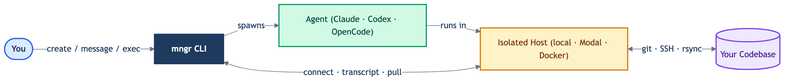

# mngr: build your team of AI engineering agents

[](https://github.com/imbue-ai/mngr)
[](https://pypi.org/project/imbue-mngr/)
[](https://pypi.org/project/imbue-mngr/)
[](./LICENSE)
[](https://github.com/imbue-ai/mngr/issues)


**Spin up isolated AI coding agents — locally or in the cloud — with a single CLI.**
*Built on SSH, git, and tmux. Extensible via plugins. No managed service required.*

> **Why mngr?** Most agent tooling is a managed cloud: opaque infrastructure, per-seat pricing, hard to script. mngr takes the opposite approach — agents run in isolated containers you own, over SSH you can inspect, on compute that shuts down when idle. It's built on primitives you already know (SSH, git, tmux, docker) and extensible via plugins for anything you need on top.

---

**installation:**
```bash
curl -fsSL https://raw.githubusercontent.com/imbue-ai/mngr/main/scripts/install.sh | bash
```

## What mngr can do

- **Simple** — one command launches an agent locally or on Modal; sensible defaults throughout
- **Fast** — agents start in under 2 seconds
- **Cost-transparent** — free CLI; agents auto-shutdown when idle; pay only for inference and compute
- **Secure** — SSH key isolation, network allowlists, full container control
- **Composable** — shared hosts, snapshot and fork agent state, direct exec, push/pull/pair
- **Observable** — transcripts, direct SSH, programmatic messaging
- **Easy to learn** — `mngr ask` answers usage questions without leaving the terminal

---

**mngr is *very* simple to use:**

```bash
mngr create           # launch claude locally (defaults: agent=claude, provider=local, project=current dir)
mngr create @.modal          # launch claude on Modal (new host with auto-generated name)
mngr create my-task          # launch claude with a name
mngr create my-task codex    # launch codex instead of claude
mngr create -- --model opus  # pass any arguments through to the underlying agent

# send an initial message so you don't have to wait around:
mngr create --no-connect --message "Speed up one of my tests and make a PR on github"

# or, be super explicit about all of the arguments:
mngr create my-task@.modal --type claude

# tons more arguments for anything you could want! Learn more via --help
mngr create --help

# or see the other commands--list, destroy, message, connect, push, pull, clone, and more!
mngr --help
```

**mngr is fast:**
```bash
> time mngr create local-hello  --message "Just say hello" --no-connect
Done.

real    0m1.472s
user    0m1.181s
sys     0m0.227s

> time mngr list
NAME           STATE       HOST        PROVIDER    HOST STATE  PROJECT
local-hello    RUNNING     @local      local       RUNNING     mngr

real    0m1.773s
user    0m0.955s
sys     0m0.166s
```

**mngr itself is free, *and* the cheapest way to run remote agents (they shut down when idle):**

```bash
mngr create @.modal --no-connect --message "just say 'hello'" --idle-timeout 60 -- --model sonnet
# costs $0.0387443 for inference (using sonnet)
# costs $0.0013188 for compute because it shuts down 60 seconds after the agent completes
```

**mngr takes security and privacy seriously:**

```bash
# by default, cannot be accessed by anyone except your modal account (uses a local unique SSH key)
mngr create example-task@.modal

# you (or your agent) can do whatever bad ideas you want in that container without fear
mngr exec example-task "rm -rf /"

# you can block all outgoing internet access
mngr create @.modal -b offline

# or restrict outgoing traffic to certain IPs
mngr create @.modal -b cidr-allowlist=203.0.113.0/24
```

**mngr is powerful and composable:**

```bash
# start multiple agents on the same host to save money and share data
mngr create agent-1@shared-host.modal --new-host
mngr create agent-2@shared-host

# run commands directly on an agent's host
mngr exec agent-1 "git log --oneline -5"

# never lose any work: snapshot and fork the entire agent states
mngr create doomed-agent@.modal
SNAPSHOT=$(mngr snapshot create doomed-agent --format "{id}")
mngr message doomed-agent "try running 'rm -rf /' and see what happens"
mngr create new-agent --snapshot $SNAPSHOT
```

**mngr makes it easy to see what your agents are doing:**

```bash
# programmatically send messages to your agents and see their chat histories
mngr message agent-1 "Tell me a joke"
mngr transcript agent-1
```

**mngr makes it easy to work with remote agents**

```bash
mngr connect my-agent       # directly connect to remote agents via SSH for debugging
mngr pull my-agent          # pull changes from an agent to your local machine
mngr push my-agent          # push your changes to an agent
mngr pair my-agent          # or sync changes continuously!
```

**mngr is easy to learn:**

```text
> mngr ask "How do I create a container on modal with custom packages installed by default?"

Simply run:
    mngr create @.modal -b "--file path/to/Dockerfile"
```

## Overview

`mngr` makes it easy to create and use any AI agent (ex: Claude Code, Codex), whether you want to run locally or remotely.

`mngr` is built on open-source tools and standards (SSH, git, tmux, docker, etc.), and is extensible via plugins to enable the latest AI coding workflows.



## Installation

Quick install (installs system dependencies + mngr automatically):

```bash
curl -fsSL https://raw.githubusercontent.com/imbue-ai/mngr/main/scripts/install.sh | bash
```

Manual install (requires uv and system deps: `git`, `tmux`, `jq`, `rsync`, `unison`):

```bash
uv tool install imbue-mngr

# or run without installing
uvx --from imbue-mngr mngr
```

Upgrade:

```bash
uv tool upgrade imbue-mngr
```

For development:

```bash
git clone git@github.com:imbue-ai/mngr.git && cd mngr && uv sync --all-packages && uv tool install -e libs/mngr
```

## Shell Completion

`mngr` supports tab completion for commands, options, and agent names in bash and zsh. Shell completion is configured automatically by the install script (`scripts/install.sh`).

To set up manually, generate the completion script and append it to your shell rc file:

Zsh (run once):

```bash
uv tool run --from imbue-mngr python3 -m imbue.mngr.cli.complete --script zsh >> ~/.zshrc
```

Bash (run once):

```bash
uv tool run --from imbue-mngr python3 -m imbue.mngr.cli.complete --script bash >> ~/.bashrc
```

Note: `mngr` must be installed on your PATH for completion to work (not invoked via `uv run`).

## Commands

```bash
# without installing:
uvx --from imbue-mngr mngr <command> [options]

# if installed:
mngr <command> [options]
```

## Sub-projects

This is a monorepo that contains the code for `mngr` here:

- libs/mngr/

As well as the code for some plugins that we maintain, including:

- libs/mngr_modal/
- libs/mngr_claude/
- libs/mngr_pair/
- libs/mngr_opencode/

The repo also contains code for some dependencies and related projects, including:

- libs/concurrency_group: a simple Python library for managing synchronous concurrent primitives (threads and processes) in a way that makes it easy to ensure that they are cleaned up.
- libs/imbue_common: core libraries that are shared across all of our projects
- apps/minds: an experimental project around scheduling runs of autonomous agents

## Contributing

Contributions are welcome. See [open issues](https://github.com/imbue-ai/mngr/issues) to find something to work on.
